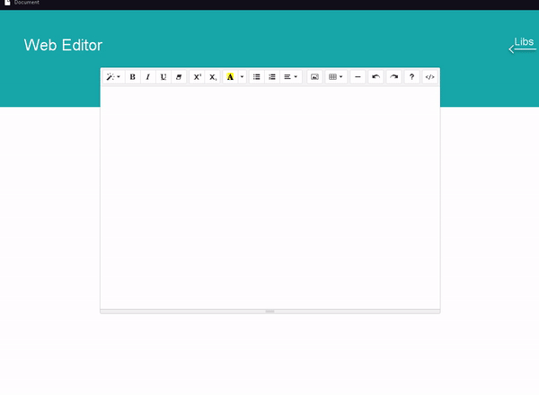

<h2 aling="center"> web-editor </h2>

 

<h3 align="center">Esse projeto é um editor de texto simples, onde o usuário pode usá-lo para fazer algumas coisas básicas de um editor de texto</h3> 

 
 

<h4 align="center">Você pode testar o editor aqui no github, basta entrar no link: <a href="https://vittxr.github.io/web-editor/">https://vittxr.github.io/web-editor/</a></h4>

 
 

 -> características/funcionalidades: 

<ul>
    <li>O editor foi feito com o <a href="href="https://summernote.org"">Summernote</a>     </li>
    <li>Clicando no botão esquerdo do mouse na área de texto, há as opções de limpar tudo e abrir arquivos. </li>
    <li href="https://www.npmjs.com/package/mammoth?activeTab=dependents">A funcionalidade de abrir arquivo foi feita através do <a>mammoth</a>, que converte arquivos DOCX para HTML. Portanto, o único formato permitido é DOCX.</li>
</ul>

 
 

  

